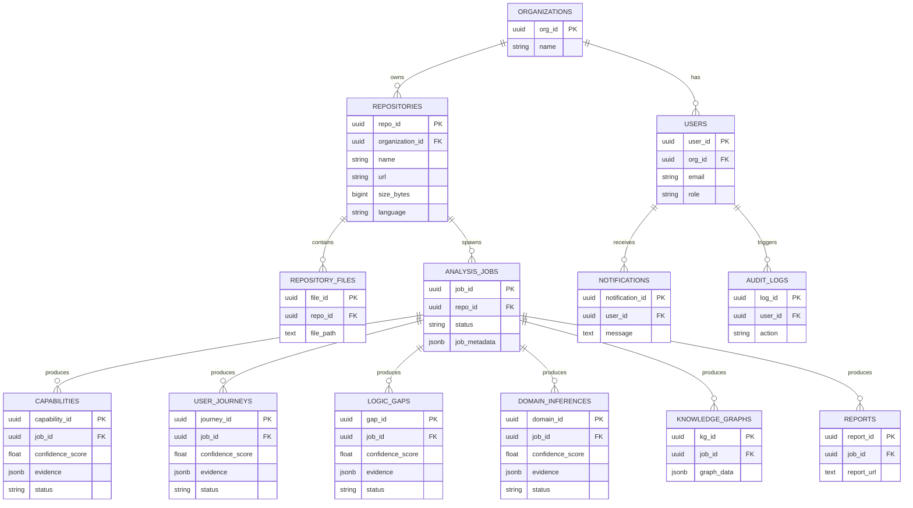

# CodeAtlas Database

This directory contains the database migration scripts and schema documentation for PostgreSQL.

## ER Diagram

## API-Layer Validation Constraints

In accordance with Phase 2.2 requirements, the following validators are enforced at the API/Application layer:
- **Email Uniqueness**: Supported by a database `UNIQUE` constraint, explicitly caught and handled by the API layer upon conflict.
- **Repo Size Limit**: API rejects uploads exceeding the max repository size limit before any bytes are processed.
- **Supported-Language Check**: API verifies the repository contains supported languages (Node.js/React/Next.js).
- **Required Job Metadata**: API strictly enforces the presence and structure of necessary configuration in `job_metadata` before initiating an AnalysisJob.
- **JWT/Role Validation**: API routing enforces RBAC mapping (Admin, Organization Owner, Developer, Viewer) on all routes.
