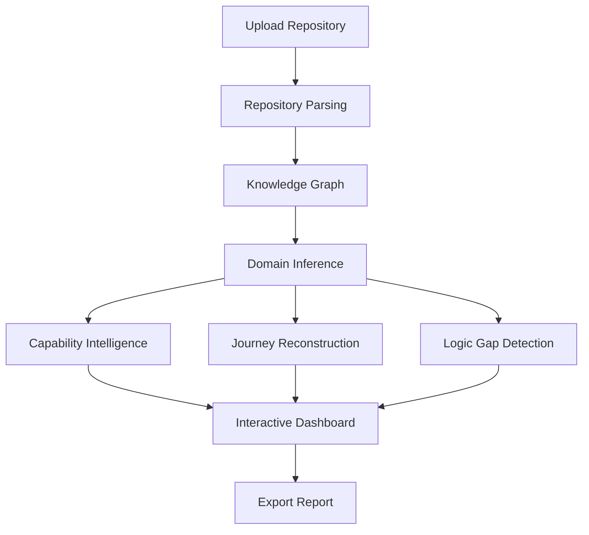

# CodeAtlas: Architecture Overview

## CodeAtlas Pipeline
The core intelligence of CodeAtlas flows sequentially through a robust, fully automated pipeline:

1. **Upload**: Users upload local repositories or connect via Git.
2. **Parse**: The system parses the source code (specifically Node.js, React, Next.js) to extract the Abstract Syntax Tree (AST) and metadata.
3. **Knowledge Graph (KG)**: Parsed elements are stored in a Neo4j graph database to map structural relationships, dependencies, and data flows.
4. **Domain Inference**: The reasoning engine establishes the core business domain, entities, and high-level boundaries.
5. **Capability, Journey & Gap Analysis**: 
   - *Capability Intelligence*: Maps code clusters to specific business capabilities.
   - *Journey Reconstruction*: Traces request paths from UI down to the database to rebuild user flows.
   - *Logic Gap Detection*: Identifies edge cases, unhandled errors, or missing business validations.
6. **Dashboard**: Findings are presented on a Next.js interactive web interface.
7. **Export**: Results can be exported as comprehensive reports.

## Simplified MVP Topology
To maximize velocity during the hackathon while preserving a correct, evidence-grounded pipeline, CodeAtlas employs a simplified, robust architecture.

- **Frontend**: Next.js + React + TypeScript + Tailwind CSS.
- **Backend (API & Compute)**: A single **FastAPI (Python) Monolith**. Contains internal module boundaries (`api/`, `parser/`, `knowledge_graph/`, `reasoning_engine/`, etc.) but deployed as one service.
- **Job Processing**: In-process asynchronous job runner via `FastAPI BackgroundTasks`. No external message broker (like RabbitMQ) is used for the MVP.
- **Databases**: 
  - **PostgreSQL**: Stores relational data (Users, Roles, Repos, Job Statuses, Settings).
  - **Neo4j**: Stores the Knowledge Graph (Nodes, Edges, Dependencies).
- **File Storage**: Local filesystem (within a workspace directory) abstracted behind a storage-adapter interface. Easily swappable to S3 later.
- **Security & Gateway**: Direct client-to-backend API calls (or via Next.js proxy). In-process rate limiting (e.g., `slowapi`). No dedicated API Gateway or Load Balancer for the MVP.

## Architecture Flow Diagram

